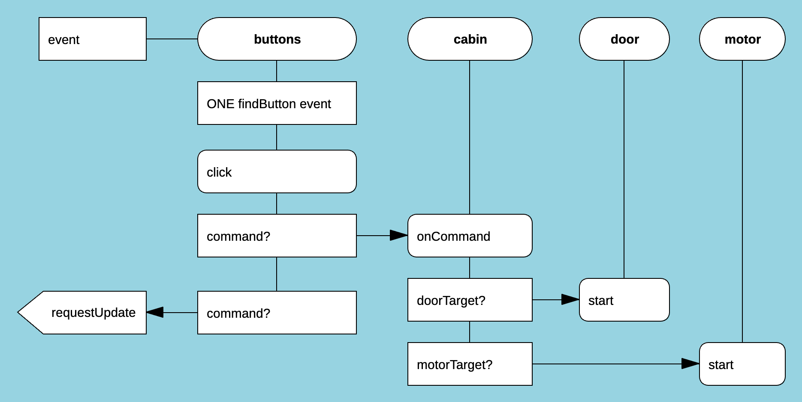

# Loops

**Loops is a visual coordination language for making program behavior explicit.**

Loops is designed for event-driven and interactive systems, where objects communicate through messages and callbacks.
In such systems, the *intention* behind the wiring is often hard to see.

Loops makes flows first-class.

A Loops diagram is not just documentation.
It is executable and defines **what happens because of what**.

Loops diagrams resemble sequence diagrams.

[See more examples of Loops diagrams](https://stepan-mitkin.github.io/loops/loops2)

[Run an interactive demo of Loops in the browser](https://stepan-mitkin.github.io/loops/loops2-lift)

## Status

**Experimental / research**

Loops is a working prototype used to explore explicit control flow, coordination, and actor-based behavior.
APIs, semantics, and tooling may change.

## What Loops is

* A **visual coordination language**
* Focused on **behavior and control flow**, not computation
* Designed to work *with* JavaScript, not replace it
* Suitable for interactive systems, UI logic, workflows, and simulations

## What Loops is not

* Not a general-purpose programming language
* Not a UI framework
* Not a replacement for JavaScript or TypeScript

## Core concepts

### Diagrams

Loops programs are defined as **diagrams**.

A typical Loops class has several Loops programs.

Diagrams are drawn using the [DrakonHub](https://github.com/stepan-mitkin/drakonhub_desktop) editor and saved as structured data.

Each diagram describes:

* a flow of execution,
* message passing between objects,
* conditional paths,
* and asynchronous behavior.

The diagram *is* the program.

### Compiler

The Loops compiler:

* reads diagrams exported from DrakonHub,
* validates their structure,
* and compiles them into **bytecode**.

The bytecode is a compact, deterministic representation of the diagram semantics.

### Runtime

The Loops runtime:

* executes the compiled bytecode,
* manages control flow and scheduling,
* and delivers messages between objects.

Loops supports asynchronous execution and delayed results.

A loop (a Loops program):

* takes **one input argument**,
* may produce **zero, one, or many results**,
* and results may arrive **later in time**.

### Objects and messaging

Loops coordinates **objects** by sending messages.

Objects may be:

* instances of **JavaScript classes**, or
* **finite state machines**.

Loops does not generate application logic.

Instead:

* the developer provides the object implementations,
* Loops calls object methods exactly as specified by the diagrams,
* and object methods may be synchronous or asynchronous.

In other words:

> **JavaScript does the work.
> Loops coordinates the work.**

## Demo

This repository includes an **interactive animated browser demo**.

[Run an interactive demo of Loops in the browser](https://stepan-mitkin.github.io/loops/loops2-lift)

The demo exists for a reason:

> Reading logs and playing a system are two different things.

The demo was used to validate that the Loops model works under real interaction and time-based behavior.

## Intended audience

Loops may be interesting to developers who care about:

* explicit control flow,
* coordination in event-driven systems,
* actor-based design,
* and making program behavior visible.

## License

The Unlicense
